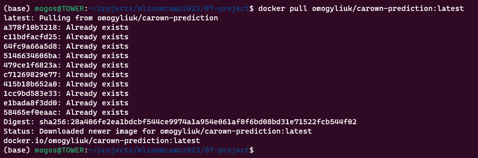
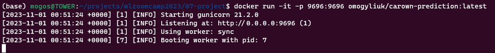
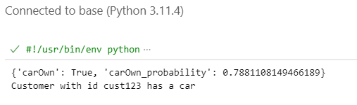

# Midterm project

## Data

### Source: https://www.kaggle.com/datasets/rkiattisak/car-ownership-predictionbeginner-intermediate

The dataset contains information on the occupation, monthly income, credit score, years of employment, finance status, finance history, number of children, and car ownership

The goal of this project is to create a model to predict car ownership based on the given features.

In this project the Jupyter notebook contains the following steps:
* Load the dataset
* Clean the dataset
* Split it to train, validate, test data subsets
* Build different type of models and selecting the best one

### How to use

* Load docker image  
```bash
docker pull omogyliuk/carown-prediction:latest
```  
* or build the image  
```bash
docker build -t carown-prediction .
```
* Run the container  
```bash
docker run -it -p 9696:9696 omogyliuk/carown-prediction:latest
```
* or if you built the image on your own 
```bash
docker run -it -p 9696:9696 carown-prediction
```
* Run `predict-test.py`

### Example

* Load docker image  
```bash
docker pull omogyliuk/carown-prediction:latest
```

* Run the container  
```bash
docker run -it -p 9696:9696 omogyliuk/carown-prediction:latest
```
  
* Run `predict-test.py`  
